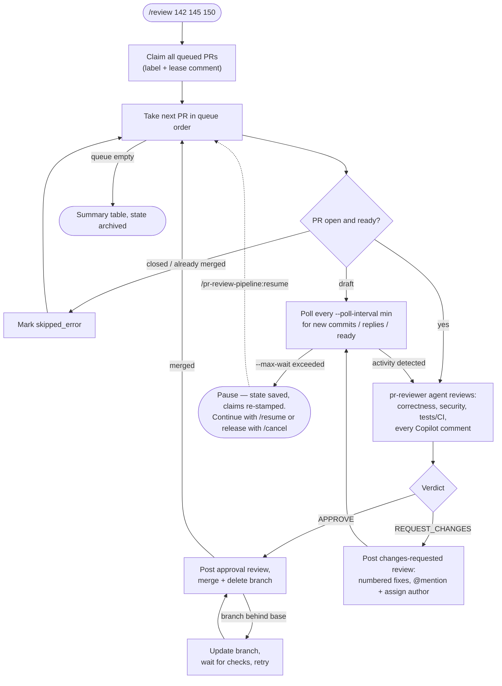

# pr-review-pipeline

A Claude Code plugin that reviews a queue of GitHub PRs in strict order: review → address Copilot comments → approve & merge, or request changes with an @mention to the author and wait for fixes before moving on.

## Prerequisites

- [GitHub CLI](https://cli.github.com/) installed and authenticated (`gh auth login`) with permission to review and merge in the target repo
- Run commands from inside a clone of the target repo

## Install

This repo is its own plugin marketplace (`.claude-plugin/marketplace.json`), so add it as a marketplace first — `/plugin install` only accepts `<plugin>@<marketplace>`, never a path.

Option A — from GitHub:

```
/plugin marketplace add davidzayas/pr-review-pipeline
/plugin install pr-review-pipeline@pr-review-pipeline
```

Option B — from a local clone:

```
/plugin marketplace add /path/to/pr-review-pipeline
/plugin install pr-review-pipeline@pr-review-pipeline
```

Option C — development, no install (loads the plugin for one session):

```
claude --plugin-dir /path/to/pr-review-pipeline
```

Validate: `/plugin validate /path/to/pr-review-pipeline`

## Usage

The plugin has four commands. `review` starts a run, `status` inspects it, `resume` continues a paused one, `cancel` stops one and releases its claims.

### `/pr-review-pipeline:review <pr-number> [pr-number...] [flags]`

Starts the pipeline over the PR numbers you list. **Order matters**: PRs are processed strictly in the order given, and the pipeline never advances past a PR that hasn't been merged (or skipped as unprocessable). Put your highest-priority PR first.

```
/pr-review-pipeline:review 142 145 150
/pr-review-pipeline:review 142 145 --merge-method rebase --poll-interval 10 --max-wait 120
```

| Flag | Values | Default | What it controls |
|------|--------|---------|------------------|
| `--merge-method` | `squash`, `merge`, `rebase` | `squash` | How an approved PR is merged. All methods delete the source branch after merging. |
| `--poll-interval` | minutes | `5` | How often a blocked PR (changes requested, draft, or pending checks) is re-checked for new commits, replies, or readiness. |
| `--max-wait` | minutes | `240` (4 hours) | Total time to keep polling a blocked PR before the pipeline pauses itself. The budget applies per blocking episode, not per run. |

How the two timing flags work together: when a PR gets blocked, the pipeline sleeps `--poll-interval` minutes, re-checks the PR, and repeats until either something changed (new commits, author replies, draft marked ready, checks finished) or `--max-wait` minutes have elapsed in total. With the defaults that is a check every 5 minutes for up to 4 hours. Raise `--poll-interval` for a quieter loop on slow-moving repos; lower `--max-wait` if you'd rather have the pipeline hand control back to you quickly instead of waiting on authors.

### `/pr-review-pipeline:status`

Read-only. Shows a table of every PR in the queue — its pipeline status, live GitHub state, and check results — and highlights which PR is currently blocking the pipeline and why. Works during a run, while paused, and after completion (it falls back to the archived state of the last finished run). Safe to run anytime.

### `/pr-review-pipeline:resume`

Continues a paused or interrupted run from the saved state file, picking up at the right step for wherever it left off: a PR waiting on its author resumes polling (or re-reviews immediately if there's been activity), a PR that was approved but not merged retries the merge, and anything not yet reviewed starts fresh. You can resume in a brand-new Claude Code session — state lives on disk, not in the conversation.

### `/pr-review-pipeline:cancel`

Cancels the current run: asks for confirmation, releases every claim the run
still owns (label removed, claim comment edited to "released"), marks the
run `cancelled`, and archives its state. Claims owned by a newer run are
left untouched. If GitHub is unreachable the run is still cancelled locally
and the remote claims are left to go visibly stale.

## How it works

Each PR moves through review → verdict → merge-or-wait. This is the loop the pipeline runs for every PR in your queue:



The mental model: **the pipeline is a strict queue with one gate — merged.** A PR either makes it through the gate or the whole line waits behind it. You kick it off, and the pipeline drives each PR to a decisive outcome:

1. **Gather context.** The PR's metadata, full diff, all review comments (including GitHub Copilot's), and CI status are pulled via `gh`.
2. **Review.** The bundled `pr-reviewer` agent evaluates correctness, security, and test coverage, and classifies **every unresolved Copilot comment** as fix-required, already-addressed, or not-applicable (with a reason). It returns a decisive `APPROVE` or `REQUEST_CHANGES` — never a hedged "approve with comments."
3. **Approve path.** An approval review is posted with the reasoning and each Copilot comment's disposition, then the PR is merged (per `--merge-method`, deleting the branch). If the branch is merely behind base, it's updated and the merge retried once checks pass; real conflicts are treated as a changes request.
4. **Request-changes path.** A changes-requested review is posted with a numbered list of concrete fixes (file, line, and how to resolve), the author is @mentioned and assigned, and the pipeline starts polling.
5. **Waiting.** A blocked PR — changes requested, draft, or pending required checks — is polled per the timing flags. Any activity (new commits, author replies, draft marked ready) triggers a **full re-review from scratch**, so fixes get the same scrutiny as the original diff.
6. **Pause & resume.** If `--max-wait` runs out with no activity, the run saves its state and pauses, telling you exactly which PR is blocked and why. Nothing is lost: `/pr-review-pipeline:resume` continues from that exact point, even days later or in a different session.
7. **Completion.** When every PR is merged (or skipped with a reason), you get a summary table and the state file is archived.

### Ownership claims

When a run starts it claims every queued PR on GitHub: a `pr-pipeline` label
plus one pinned-style comment per PR stating who owns it, the current
pipeline status, and — critically — a **stale-after deadline** (last update
+ `--max-wait`). The comment is edited in place at every transition, so an
abandoned run is self-evident: past the deadline with no verdict, the
comment itself says the claim may be ignored and the label removed. Claims
are released when a PR reaches a terminal state (merged / skipped), on
`/cancel`, and never automatically on staleness. If a new `/review` finds a
live claim from another run, it asks for explicit takeover confirmation
before reclaiming (a generation counter in the comment prevents the old run
from overwriting the new owner). All claim operations are best-effort — a
GitHub hiccup never blocks the review pipeline itself.

### Pipeline state

Progress is tracked in `.claude/pr-pipeline-state.json` in the target repo, updated after every transition — this is what makes `status` and `resume` work at any time. Each queued PR carries one of these statuses:

| Status | Meaning |
|--------|---------|
| `pending` | Queued, not yet reviewed |
| `reviewing` | Review in progress |
| `changes_requested` | Changes-requested review posted; author notified |
| `waiting` | Being polled for activity |
| `approved` | Approved but not yet merged (e.g., merge retry in progress) |
| `merged` | Done — pipeline moved on |
| `paused` | Wait budget exhausted; run stopped, resumable |
| `skipped_error` | Unprocessable (closed, already merged, or author closed it) |

On completion the file is archived to `.claude/pr-pipeline-state.last.json`. You may want to add both paths to the target repo's `.gitignore`.

### Typical session

```
/pr-review-pipeline:review 142 145 150     # kick off, go do something else
/pr-review-pipeline:status                 # peek: 142 merged, 145 waiting on author
                                           # ...max-wait expires, pipeline pauses...
/pr-review-pipeline:resume                 # next morning: author pushed fixes → re-review → merge → on to 150
```

## Safety rails

- Never merges over failing required checks or branch protections
- Never pushes commits to the author's branch
- Pauses (rather than retries) on auth/permission errors

## Layout

```
pr-review-pipeline/
├── .claude-plugin/
│   ├── plugin.json
│   └── marketplace.json   # repo doubles as its own marketplace
├── commands/
│   ├── review.md    # /pr-review-pipeline:review
│   ├── resume.md    # /pr-review-pipeline:resume
│   ├── status.md    # /pr-review-pipeline:status
│   └── cancel.md    # /pr-review-pipeline:cancel
├── agents/
│   └── pr-reviewer.md
├── claim-protocol.md   # shared ownership-claim mechanics for review/resume/status/cancel
└── README.md
```
